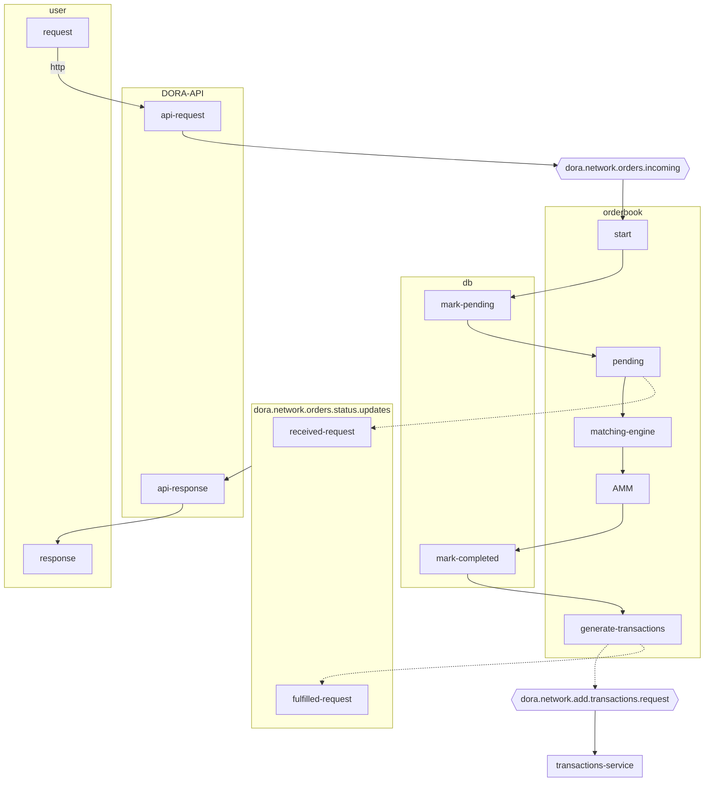

# orderbook

orderbooks keep track of buys and sells in a market.


## "ordinary" orderbooks

Buyer B0 - willing to buy 200 units at 16 

buyer prices are sorted DESCENDING
seller prices are sorted ASCENDING

lowest price matches first
- buyer gets all 100 from S0 at $10, closing out S0's order
- buyer gets 100/150 from S1 at $15
- this closes out B0's order, leaving S1 with partial sell order of 50 units @ $15

## DORA's orderbook - uses AMM - Automated Market Maker

AMM automatically sets the 'market price' for each kind of asset against each other.

Suppose buyer B0 wants to **receive** A in exchange for B. Suppose I want to exchange currencies - USD for GBP. 

## scenario 1: "market order"
As a **user**, I want to buy N units of A at the current exchange rate for B.




## market price changing in response to fulfilled order

```mermaid
```